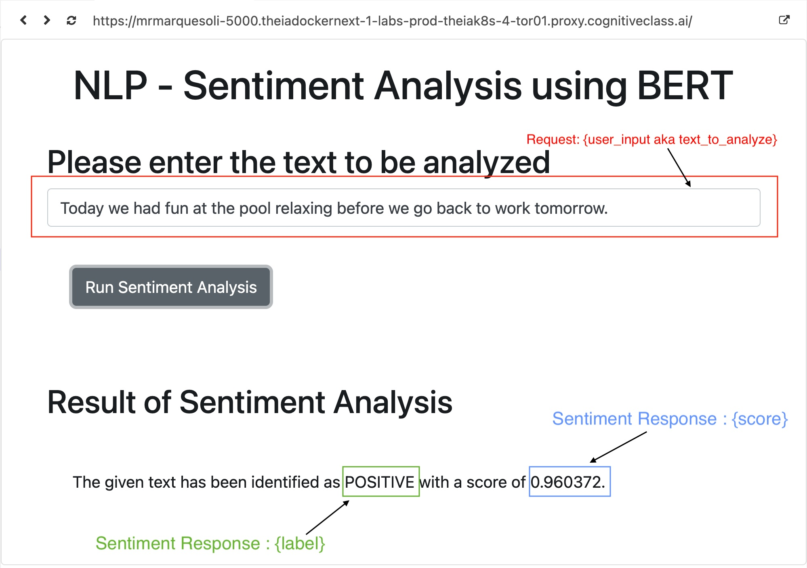

# NC Moodmapper- powered by BERT
### 🧱 How To Use
1. Clone Repository
2. Install required libraries using requirements.txt
    * `pip install -r requirements.txt`
3. Run `python3 server.py`
4. Typically the server is ran on **localhost:5000**, however a relevant link will populate. 
#### - 📸 Screenshots - 
###### Home Screen

###### Home Screen Labeled

#### Features - 
| Feature | Description |
| ----------- | ----------- |
| RESTful | Title |
| Error Handling     | Text |