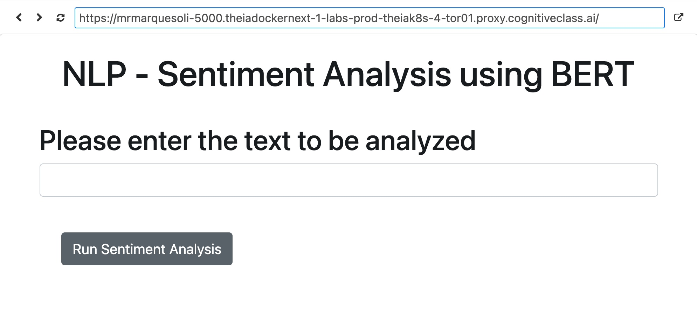

# NC Moodmapper- powered by BERT
### - 🧱 How To Use -
1. Clone Repository
2. Install required libraries using requirements.txt
    * `pip install -r requirements.txt`
3. Run `python3 server.py`
4. Typically the server is ran on **localhost:5000**, however a relevant link will populate. 

### - ✚ Features - 
| Feature | Description |
| ----------- | ----------- |
| BERT | Sentiment analysis powered by BERT via WAtson NLP API |
| Flask     | Flasked-based web interface for easy interaction |
| Real-time Feedback     | Returns real-time feedback with sentiment label and confidence score.. |
| Error Handling     | User friendly error handling |
| Pylint    | Pylint-linted codebase adhering to PEP8 |

### - 📸 Screenshots - 
###### Home Screen

###### Home Screen Labeled

